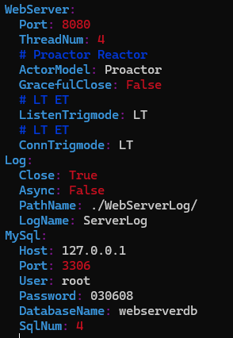

# TinyWebserver

## 参考资料

1. [小白视角：一文读懂社长的TinyWebServer | HU (huixxi.github.io)](https://huixxi.github.io/2020/06/02/小白视角：一文读懂社长的TinyWebServer/#more)
2. [《Linux高性能服务器编程》](https://book.douban.com/subject/24722611/)


## 运行演示

编译运行：

```shell
# 执行 build 脚本编译服务器
$ ./build
$ ./myserver
```

服务器首页：


登录页面：


登录成功后进行网站功能测试：


观看图片：


观看视频：


## 压力测试

处理器：12th Gen Intel(R) core(TM) i5-12500H

1. 测试 1：

   Server：

   

   wrk：20 负载线程，200 个并发连接，10s 测试

   ```shell
   $ ./wrk -t20 -c200 -d 10s --latency http://localhost:8080/
   Running 1m test @ http://localhost:8080/
     20 threads and 200 connections
     Thread Stats   Avg      Stdev     Max   +/- Stdev
       Latency    10.30ms   65.11ms   1.77s    98.36%
       Req/Sec   811.73    416.90     2.74k    71.79%
     Latency Distribution
        50%    4.18ms
        75%    4.44ms
        90%    4.81ms
        99%  182.61ms
     936499 requests in 1.00m, 1.33GB read
     Socket errors: connect 0, read 19, write 0, timeout 28
   Requests/sec:  15595.11
   Transfer/sec:     22.68MB
   ```

# ToDo

- [ ] 基于 Trie 树，实现路由功能
- [x] 解决目前 MySQL 连接池的连接回收问题
- [ ] 封装 Context 上下文

